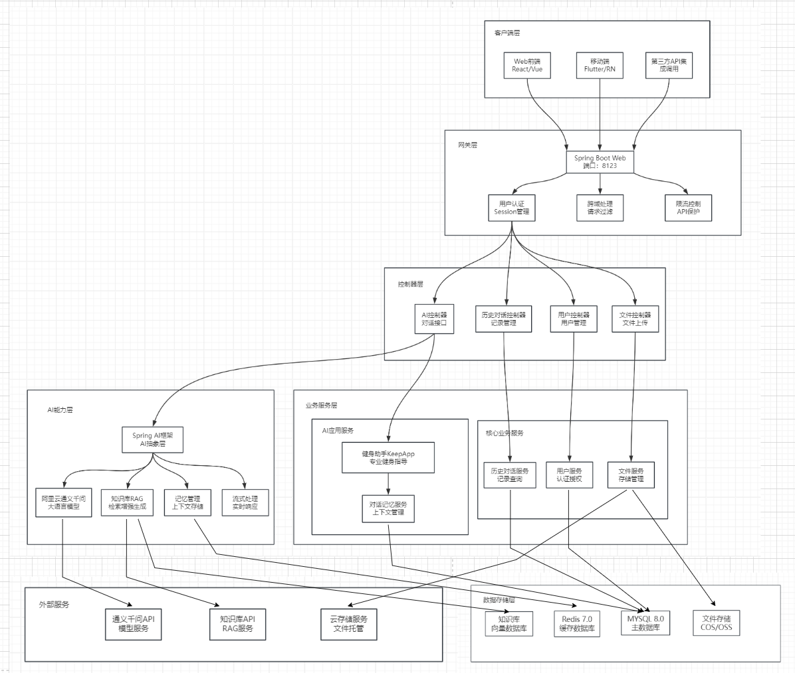

<div align="center">

# 🏋️‍♂️ AI 智能健身教练平台

**基于 Vue 3 + Spring AI 的全栈现代化智能健身管理系统**

</div>

---

## 📖 项目简介

**AI 智能健身教练平台** 是一个集成了前沿人工智能技术的全栈健身管理解决方案。项目采用前后端分离架构，旨在为用户提供个性化的健身指导、科学的数据追踪和智能化的训练建议。

*   **前端**：基于 **Vue 3** 生态系统构建，采用 Arco Design UI 库，提供流畅的响应式交互体验。
*   **后端**：基于 **Spring AI** 和 **Spring Boot 3.4** 构建，集成了阿里云通义千问大模型，RAG 知识库问答及工具调用。

### ✨ 核心特色

#### 🤖 专业AI健身教练
- 专注于健身领域，提供个性化训练方案、动作指导及营养建议。


#### 🚀 技术亮点
- **实时流式对话**: 基于 SSE (Server-Sent Events) 技术，实现类 ChatGPT 的打字机式流畅对话体验。
- **RAG 知识库增强**: 集成专业健身知识库，AI 回答更精准、更专业。
- **智能数据分析**: 可视化追踪体重、体脂率、BMI 等数据趋势，AI 自动生成分析报告。
- **持久化记忆**: 基于 MySQL 的对话历史管理，AI 能够记住上下文，提供连贯服务。

---

## 🏗️ 系统架构

项目采用现代化的微服务架构思想，前后端通过 RESTful API 和 SSE 进行通信。

### 架构概览


### 数据流向


---

## 🛠️ 技术栈

| 类别 | 技术组件 | 说明 |
| :--- | :--- | :--- |
| **前端框架** | Vue 3.2 (Composition API) | 核心前端框架 |
| **UI 组件库** | Arco Design Vue 2.57 | 企业级 UI 设计语言 |
| **状态管理** | Pinia / Vuex | 前端状态与用户 Session 管理 |
| **后端框架** | Spring Boot 3.4.6 | 核心后端框架 |
| **AI 框架** | **Spring AI** | 接入大模型编排 |
| **大模型** | 阿里云通义千问 (Qwen) | 核心 LLM 能力支持 |
| **数据库** | MySQL 8.0 | 用户数据与对话历史存储 |
| **ORM** | MyBatis-Plus | 数据持久层框架 |
| **通信协议** | HTTP / SSE (Server-Sent Events) | 前后端交互与流式传输 |

---

## 📂 项目结构

```
project-root/
├── frontend/    # 前端项目 (Vue 3)
│   ├── public/                 # 静态资源
│   │   ├── index.html         # HTML模板
│   │   └── favicon.ico        # 网站图标
│   ├── src/                   # 源代码目录
│   │   ├── components/        # 公共组件
│   │   │   ├── AppCard.vue    # 卡片组件
│   │   │   ├── ChatInterface.vue  # 聊天界面组件
│   │   │   └── ChatManager.vue    # 聊天管理组件
│   │   ├── views/             # 页面组件
│   │   │   ├── Home.vue       # 首页
│   │   │   ├── Login.vue      # 登录页
│   │   │   ├── Register.vue   # 注册页
│   │   │   ├── UserProfile.vue # 个人中心
│   │   │   ├── FitnessData.vue # 健身数据
│   │   │   ├── FitnessPlans.vue # 健身计划
│   │   │   ├── FitnessKnowledge.vue # 健身知识库
│   │   │   └── FitnessMaster.vue # AI健身教练
│   │   ├── stores/            # 状态管理
│   │   │   └── user.js        # 用户状态管理
│   │   ├── services/          # API服务
│   │   │   ├── api.js         # API接口封装
│   │   │   └── localStorage.js # 本地存储服务
│   │   ├── router/            # 路由配置
│   │   │   └── index.js       # 路由定义
│   │   ├── styles/            # 样式文件
│   │   │   ├── main.scss      # 主样式文件
│   │   │   └── compatibility.scss # 兼容性样式
│   │   ├── assets/            # 静态资源
│   │   ├── App.vue            # 根组件
│   │   └── main.js            # 应用入口
│   ├── package.json           # 项目配置
│   └── jsconfig.json          # JS配置
│
├── backend/             # 后端项目 (Spring Boot)
│   ├── src/main/java/com/mq/mqaiagent/
│   │   ├── agent/           # AI 核心 (ReAct, Tools)
│   │   ├── app/             # 应用服务 (KeepApp)
│   │   ├── controller/      # API 控制器
│   │   └── rag/             # RAG 知识库配置
│   └── sql/                 # 数据库初始化脚本
│
└── README.md                # 综合说明文档
```

---

## 🚀 快速开始

### 1. 环境准备
确保您的开发环境满足以下要求：
- **Java**: JDK 21+
- **Node.js**: >= 14.0.0
- **MySQL**: >= 8.0
- **Maven**: >= 3.8
- **Git**

### 2. 后端启动 (mq-ai-agent)

1.  **配置数据库**
    ```bash
    # 进入后端目录
    cd mq-ai-agent
    # 登录 MySQL 并执行初始化脚本
    mysql -u root -p < sql/create_table.sql
    ```

2.  **配置环境变量**
    在 `mq-ai-agent/src/main/resources` 目录下创建或修改配置文件，填入您的 API Key：
    ```yaml
    spring:
      ai:
        dashscope:
          api-key: your_dashscope_api_key # 阿里云通义千问 Key
    ```

3.  **运行服务**
    ```bash
    cd backend
    ./mvnw spring-boot:run
    ```
    后端服务将在 `http://localhost:8123` 启动。

### 3. 前端启动 (mq-ai-agent-frontend)

1.  **安装依赖**
    ```bash
    # 打开新的终端窗口，进入前端目录
    cd frontend
    
    # 安装依赖
    npm install
    ```

2.  **配置 API 地址**
    检查 `src/services/api.js`，确保 `baseURL` 指向后端地址：
    ```javascript
    baseURL: 'http://localhost:8123/api',
    ```

3.  **启动开发服务器**
    ```bash
    npm run serve
    ```
    前端页面将在 `http://localhost:8080` 启动。

---

## 📱 功能演示

### 🏋️‍♂️ 智能健身计划
AI 根据您的身体数据（体重、BMI、体脂率）自动生成周/月训练计划，并实时调整。

### 💬 沉浸式 AI 对话
支持流式响应，打字机效果。您可以询问："帮我制定一个减脂食谱" 或 "深蹲时膝盖痛怎么办？"。

### 📊 数据可视化
直观的图表展示您的身体变化趋势，让每一次进步都清晰可见。


---

## 🤝 贡献指南

欢迎提交 Pull Request 或 Issue！

1.  Fork 本仓库
2.  创建特性分支 (`git checkout -b feature/AmazingFeature`)
3.  提交更改 (`git commit -m 'Add some AmazingFeature'`)
4.  推送到分支 (`git push origin feature/AmazingFeature`)
5<!-- filepath: README.md -->
<div align="center">